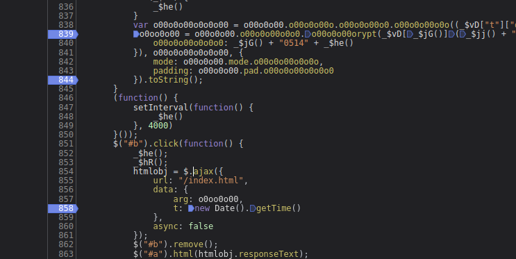

在JS逆向系列课的第13课《螳臂当⻋ 解密！AES 并不是每次都奏效》中，我们学会了 AES 的理论知识并进行了部分代码的分析。 那么这是一道综合题，在过掉无限 debugger 后找出关键加密逻辑，并模拟。请运用你所学到的或是积累的知识，尝试做一下这道题吧~ 还望分析出密钥 key 的值，及进行 hook 测试，不要为了做题而做题

请问：

请给出你模拟的加密内容 text (此值为固定字符串)

# 复习AES对称加密

### AES 是典型的对称加密算法

### AES 三个要素
    
1.密钥
    
    128位
    192位
    256位

2.填充 （padding）

    NoPadding
    PKCS7Padding
    ZeroPadding
    Ansix923
    Iso10126
    Iso9791

3.工作模式 （mode）
    
    CBC,ECB,CTR,CFB,OFB
    
    ECB:1简单;2有利于计算;3相同的明文块经过加密会变成相同的密文块,因此安全性较差
    
    CBC:1无法并行计算,性能上不如ECB;2引入初始化向量IV,增加复杂度;3安全性高

### AES 的加密流程

1. 把明文按照128bit分成若干个明文块
2. 按照选择的填充方式来填充最后一个明文块
3. 每一个明文块利用AES加密器和密钥,加密成密文块
4. 拼接所有的密文块,成为最终的密文结果

### AES 的代码流程

    const CryptoJS = require("crypto-js");
    
    let value = "123456"; //待加密的字符串
    let secret_value = "af25-87hk-a35v-5"; //密匙 16位
    let iv_value = "af25-87hk-a35v-5"; // 初始向量 initial vector 16位
    
    // 密匙和向量处理
    let secret = CryptoJS.enc.Utf8.parse(secret_value);
    let iv = CryptoJS.enc.Utf8.parse(iv_value);
    
    // 加密
    let encrypted = CryptoJS.AES.encrypt(value, secret, {
        iv: iv,
        // mode 支持 CBC, CFB,CTB,ECB,OFB,OFB, 默认CBC
        mode: CryptoJS.mode.CBC,
    
        // NoPadding, zeropadding 默认Pkcs7 即 pkcs5
        padding: CryptoJS.pad.Pkcs7
    });
    
    // 将加密结果转换为字符串
    encrypted = encrypted.toString();
    
    // 解密，传入密文，密钥盒向量设置加密与填充模式
    let decrypted = CryptoJS.AES.decrypt(encrypted, secret, {
        iv: iv,
        // mode 支持 CBC, CFB,CTB,ECB,OFB,OFB, 默认CBC
        mode: CryptoJS.mode.CBC,
    
        // NoPadding, zeropadding 默认Pkcs7 即 pkcs5
        padding: CryptoJS.pad.Pkcs7
    });
    
    // 将解密结果转换为utf8字符串
    decrypted = CryptoJS.enc.Utf8.stringify(decrypted);
    
    console.log(value);
    console.log(encrypted);
    console.log(decrypted);

### AES 加密结果

可以是hex, base64

找出请求地址：

    https://js-crack-course-13-1.crawler-lab.com/index.html?arg=0OlDT0Tr95%2BJhJFoxLohvH0%2FbmSZyrDUy8y7aQEvyIAhfwqcZHdskAj9uBoLy93R&t=1663145902355

断点

