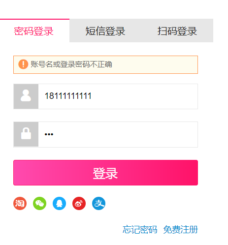
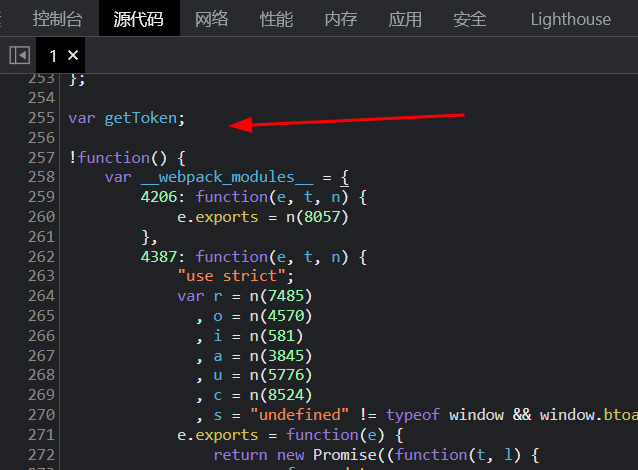
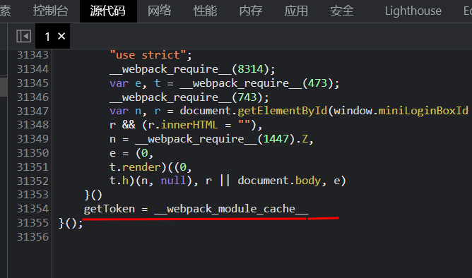
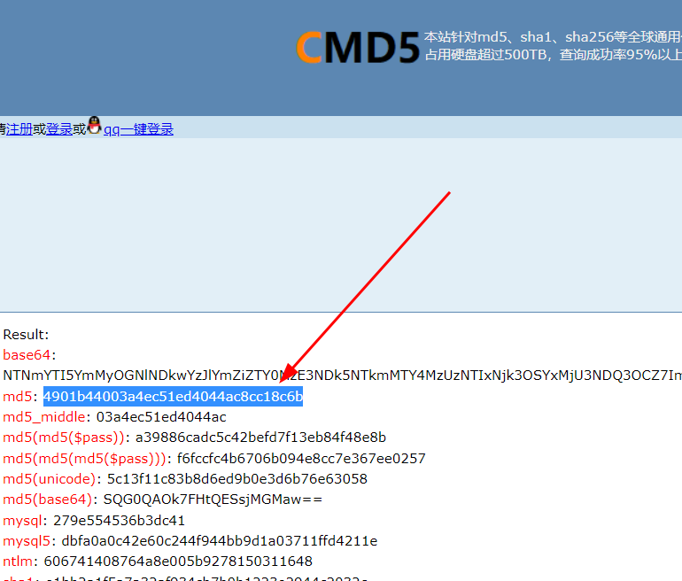

# 知识点： webpack打包

凡是遇到webpack打包的js项目，直接全局导出解密模块去执行，通过在浏览器环境测试成功后在改写成node环境下的执行。

## 登陆页面

**参数：password2**

请求登陆页面

发现`password2`参数加密

全局搜索`password2`，找到加密点，不难发现`password2`是通过函数`e = this.rsaPassword(this.passwordNode.value())`得到

进入函数调试，发现类似RSA加密

这公钥没有做base64，不能确定是否存在魔改的情况

先不管他，直接导出模块执行。把index.js全部复制到浏览器源代码中执行，头部加上`var getToken`;

尾部加上`getToken = __webpack_module_cache__`

在补全`window`全局变量参数

    window.PAGE_START_LOAD_TIME = new Date().getTime();
    window.LOGIN_UMID_LOAD = true;
    window.viewConfig = {....},
    window.viewData = {.....};
    window._lang = {.....};

控制台测试

    new getToken[1641].exports.default((0)).rsaPassword('123456')
   

能成功打印出加密后的值。

**参数：password2**

## 订单确认页面

存在`sign`加密参数

断点定位加密参数位置

这里直接告诉你答案：就是原生md5加密

