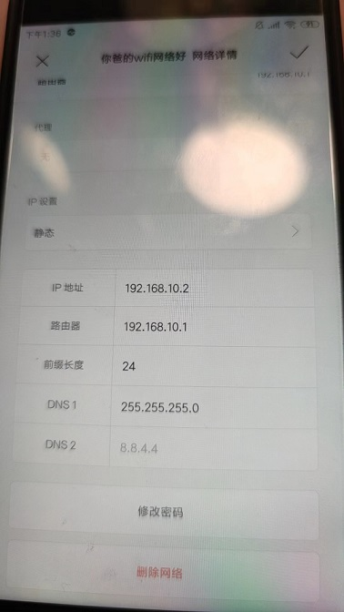
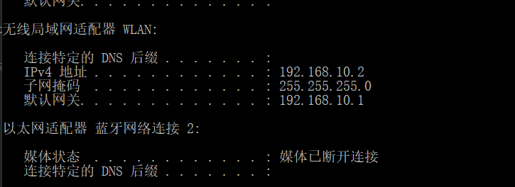

# 学习资料

1. 【Linux运维必学之Iptables防火墙】从基础介绍到实战应用，小白可入，轻松上手
   https://www.bilibili.com/video/BV1Y94y1y7M2?p=1
2. 超级详细的iptable教程文档
   https://www.cnblogs.com/Dicky-Zhang/p/5904429.html
3. iptables包过滤与网络地址转换
   https://www.bilibili.com/video/BV1Vy4y1a7Rd/
4. 透明代理
   https://docs.mitmproxy.org/archive/v8/howto-transparent/

## 防火墙常用命令行

    # 查看版本
    iptables -v

    # 查看当前防火墙规则（默认是filter表）
    iptables -nL

    # 查看nat表的规则
    iptables -nL -t nat

    # 清空所有规则，不处理默认规则
    iptables -F

    # 删除自定义链
    iptables -X

    # 链的计数清零
    iptables -Z

    # 拒绝22端口(在云服务器上执行禁止访问22端口就是自杀行为)
             表        链        请求协议  端口     动作 禁止
    iptables -t filter -I INPUT -p tcp --dport 22 -j DROP

    # 精准删除一条规则
    iptables -t filter -D INPUT 1

    # 查看是第几条规则
    iptables -nl --line-number
    
## NAT常用命令行

内网访问外网网络地址转换

                表     链           请求协议 出口网卡  本地网段             地址转换    外网ip
    iptables -t nat -A POSTROUTING -P tcp -o eth1 -s 192.168.1.0/24 -j SNAT --to-source 12.34.56.78

    # 如何看某个表中有哪些链和规则
    iptables -t nat -nvL

    # 激活网络接口
    ifup eth1

    # 外网ip不是固定的（网络地址转换）
    iptables -t nat -A POSTROUTING -P tcp -o eth1 -s 192.168.1.0/24 -j MASQUERADE

外网访问内网目标地址转换

    # 通过目标网卡eth1进入公网ip（公司固定ip）端口是80，转发到内网
    iptables -t nat -A PREROUTING -i eth1 -d 12.34.56.80 -p tcp --dport 80 -j DNAT --to-destination 192.168.1.1:8000

## 抓包

首先将手机上网功能配置成静态获取ip地址

查看本地的ip地址，我这边用的是无线网络所有，直接拿无线网络的参数配置

开启iptables流量重定向到mitmproxy

    # 启用IP转发
    sysctl -w net.ipv4.ip_forward=1
    sysctl -w net.ipv6.conf.all.forwarding=1

    # 禁用 ICMP 重定向
    sysctl -w net.ipv4.conf.all.send_redirects=0

    # 创建一个 iptables 规则集，将所需的流量重定向到 mitmproxy
    iptables -t nat -A PREROUTING -i eth0 -p tcp --dport 80 -j REDIRECT --to-port 9999
    iptables -t nat -A PREROUTING -i eth0 -p tcp --dport 443 -j REDIRECT --to-port 9999
    ip6tables -t nat -A PREROUTING -i eth0 -p tcp --dport 80 -j REDIRECT --to-port 9999
    ip6tables -t nat -A PREROUTING -i eth0 -p tcp --dport 443 -j REDIRECT --to-port 9999

启动mitmproxy

   mitmproxy --mode transparent --showhost -p 9999 --set block_global=false