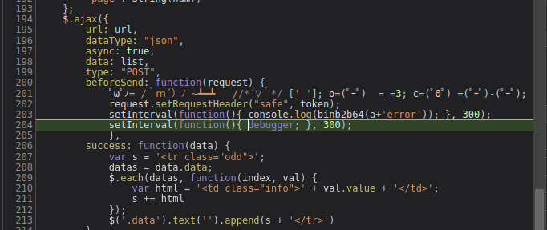
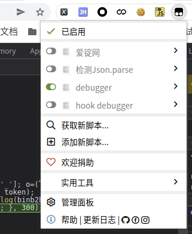
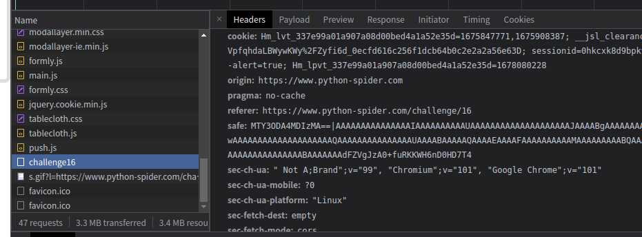
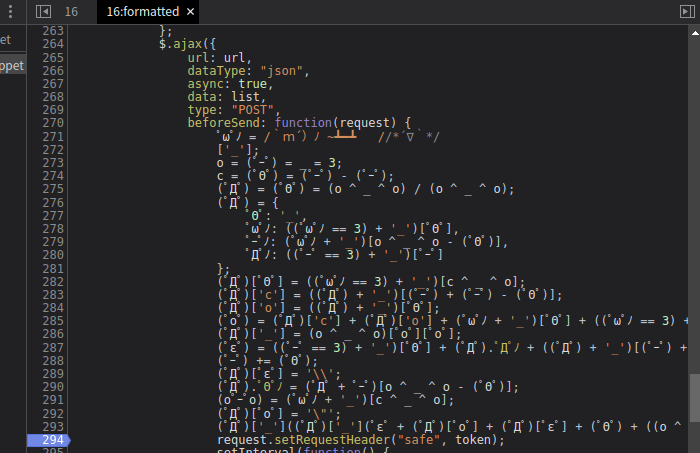
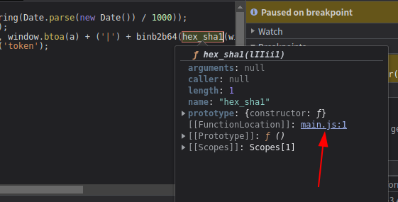

# 知识点： sojson6.0，aa混淆，setInterval定时任务

## 解题思路

打开控制台，查看请求链接，程序执行`setInterval(function(){ debugger; }, 300)`,定时任务每3毫秒执行一次

同时还存在另外一个`setInterval(function(){ console.log(binb2b64(a+'error')); }, 300)`

这里利用 Tampermonkey hook函数`setInterval`

    // ==UserScript==
    // @name        debugger
    // @namespace   http://tampermonkey.net/
    // @version     0.1
    // @description pass
    // @author      ayf
    // @run-at      document-start
    // @match        *://*.python-spider.com/*
    // @grant       none
    // ==/UserScript==

    (function() {
        var new_setInterval=setInterval;
        window.setInterval=function(a,b){
            if(a.toString().indexOf("debugger")!=-1)
            {
                return null;
            }
            if(a.toString().indexOf("console.log")!=-1)
            {
                return null;
            }
            new_setInterval(a,b);
        }
    })();

这样就可以顺利的查看请求地址，发现`safe`是加密字段

进入断点，就可以发现一断aa混淆，复制代码破解，解决方法：

.1：去掉代码最后一个符号 ('_') 后，放到浏览器里面去直接执行就可以看到源码
.2：在线调试，在 AAEncode 代码第一行下断点，然后一步一步执行，最终也会在虚拟机（VM）里看到源码

结合上下文可以发现aa混淆生成了`token`,然后又把`token`赋值给了`safe`，

    token = window.localStorage.getItem('token');
    request.setRequestHeader("safe", token);

通过控制可以顺利的打印出加密值

观察加密函数

    window.localStorage.setItem('token', window.btoa(a) + ('|') + binb2b64(hex_sha1(window.btoa(core_sha1(a)))) + b64_sha1(a));

这里面

    window.btoa(a)是base64
    binb2b64(hex_sha1(window.btoa(core_sha1(a))))包含了函数core_sha1，hex_sha1，binb2b64
    b64_sha1(a)是函数b64_sha1

进入函数体内

可以看到这段内容`jsjiami.com.v6`这就是sojson加密

用google插件v_jstools解`sojson

最后赋值js尝试执行

    a = '1678067697';
    b64_sha1_a = b64_sha1(a);
    console.log(b64_sha1_a);

    binb2b64_a = binb2b64(hex_sha1(window.btoa(core_sha1(a))));
    console.log(binb2b64_a);

    btoa_a = window.btoa(a);
    console.log(btoa_a);

发现`ReferenceError: window is not defined`报错

    binb2b64_a = binb2b64(hex_sha1(window.btoa(core_sha1(a))));
    ReferenceError: window is not defined

这里需要补一下环境`window`和`window.btoa`

    window = global;
    global.Buffer = global.Buffer || require('buffer').Buffer;

    if (typeof btoa === 'undefined') {
        global.btoa = function (str) {
            return new Buffer.from(str).toString('base64');
        };
    }

    if (typeof atob === 'undefined') {
        global.atob = function (b64Encoded) {
            return new Buffer.from(b64Encoded, 'base64').toString();
        };
    }

顺利打印出数据

