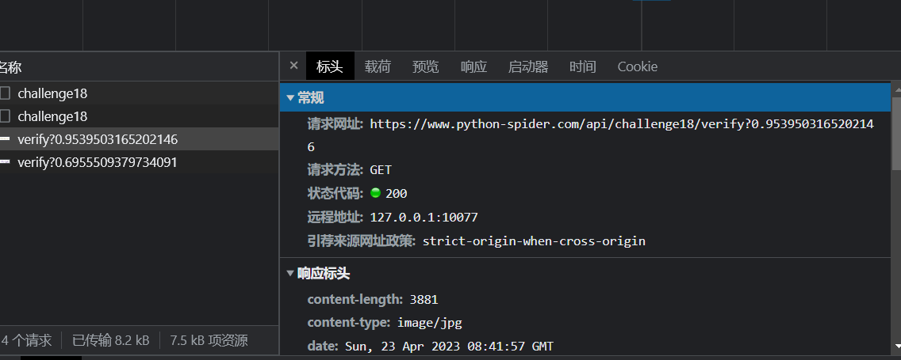
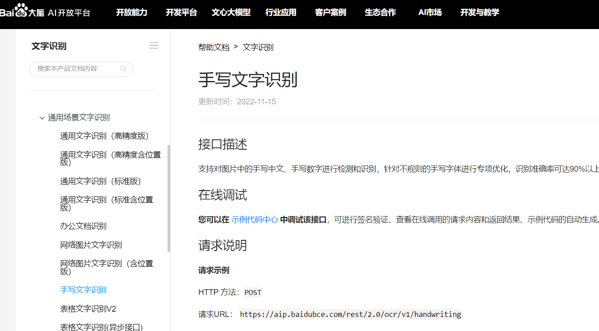
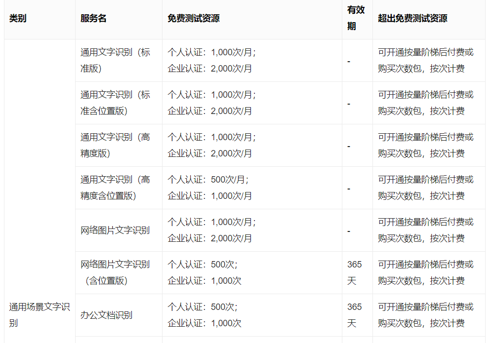
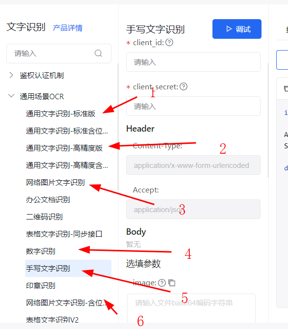
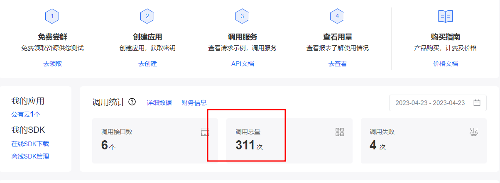

# 知识点： headers反爬，图片验证码，机器学习

## 解题思路

找了3天的机器学习资料，发现机器学习不是一朝一夕能学完的，本来打算依葫芦画瓢直接搞定，事与愿违，不理解基础知识就不能很好调试模型，既然这样那就先用百度ocr走一波。

找到图片验证码地址，这里要注意的是此地址也存在headers反爬

下面就注册百度ocr平台，

    https://ai.baidu.com/ai-doc/OCR/hk3h7y2qq

技术文档

网页调试工具

最主要的是还有免费额度，大企业果然大气多搞几个小号岂不是白嫖

ocr平台找好了，开始测试识别成功率，我这边测试了6种识别接口

发现图片进行灰度处理后+手写文字识别，成功率最高

    def processing_image(img_file, standard=200):
        """ 1.将图片进行降噪处理, 通过二值化去掉后面的背景色并加深文字对比度 """
        img = Image.open(img_file)
    
        # 灰度转换
        _image = img.convert('L')
    
        # 二值化: 根据阈值 standard, 将所有像素都置为 0(黑色) 或 255(白色), 便于接下来的分割
        pixels = _image.load()
        for x in range(_image.width):
            for y in range(_image.height):
                if pixels[x, y] > standard:
                    pixels[x, y] = 255
                else:
                    pixels[x, y] = 0
        return _image

成功通过`18验证码图片验证码-计算`题的测试结果如下：

100个数据地址，总共调用了311次百度ocr接口（包含测试期间用掉的78次），图片识别成功率在42%，百度技术已经很不错了。感觉如果自己实现一个模型并且针对此验证码单独优化，效果应该会更好。
