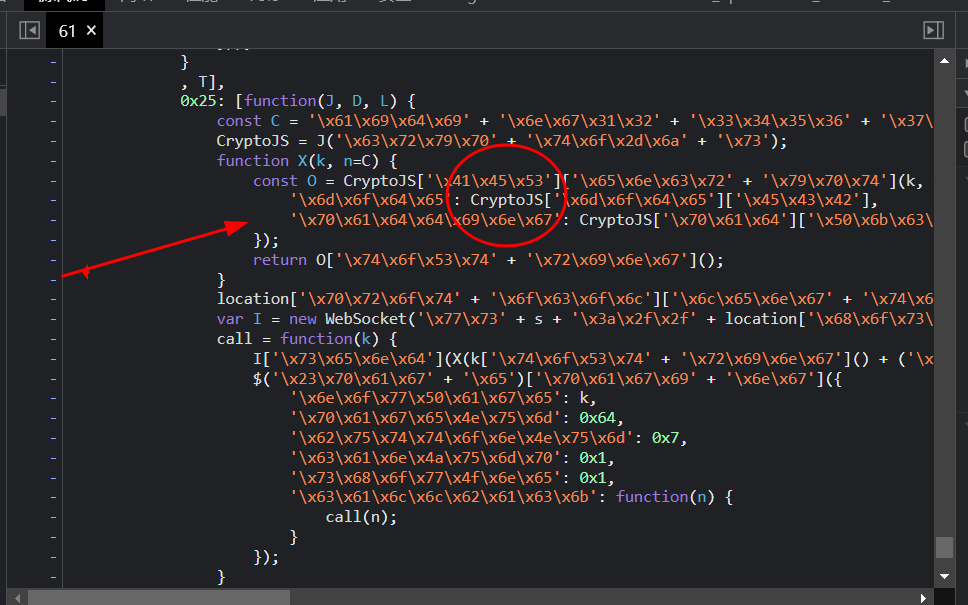
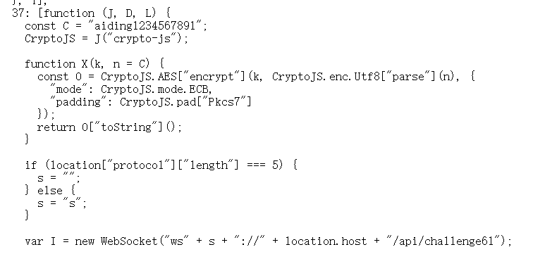
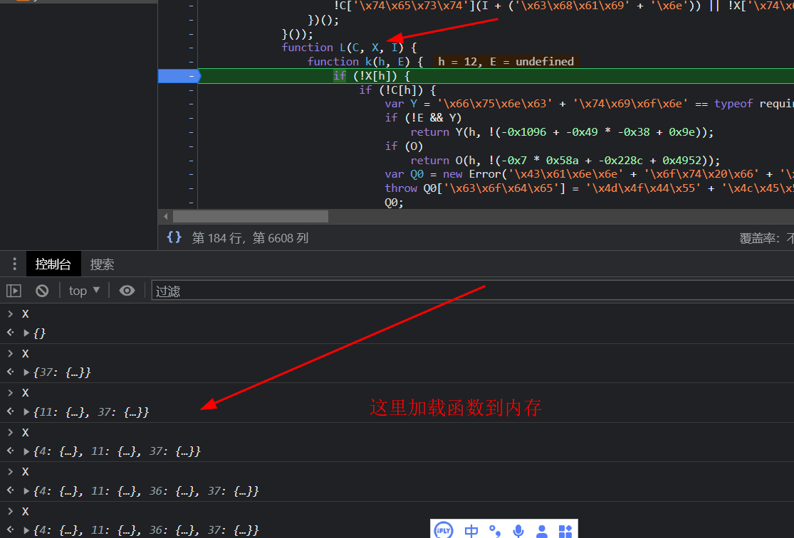
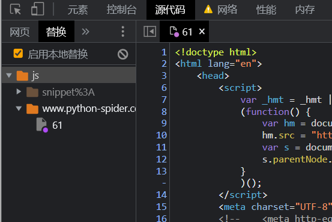
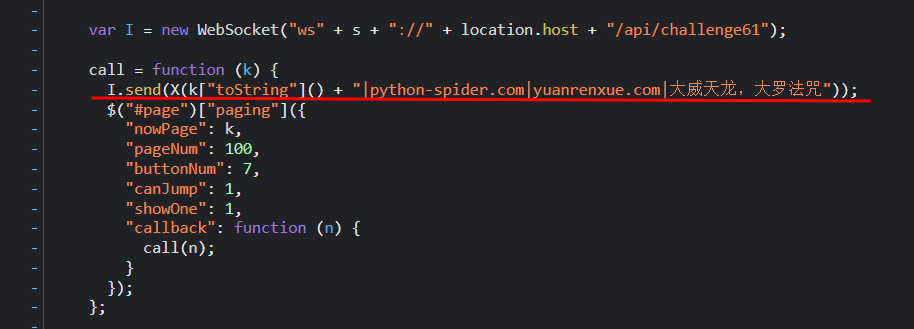
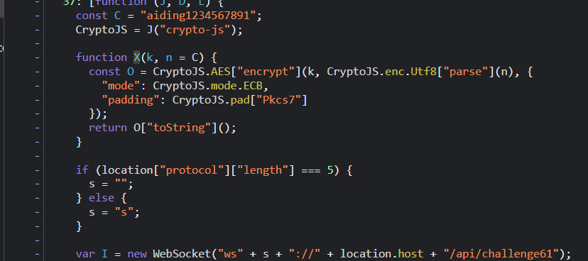
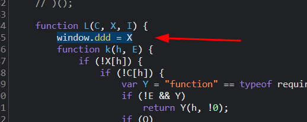
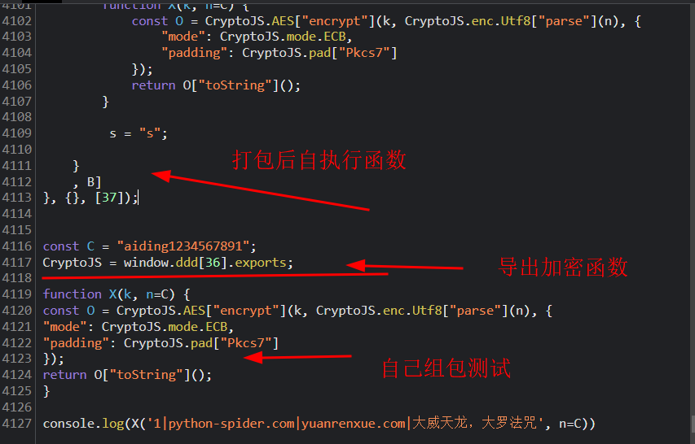
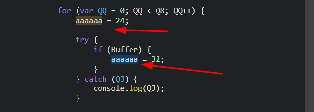

# 知识点：无限debuger,websocket,环境检测，CryptoJS.AES加密，ob混淆，browserify打包

## 解题思路

js无限debugger学习总结

    https://www.cnblogs.com/re-is-good/p/16631913.html

如果出现debugger直接上油候插件

控制台调试请求发现是`websocket`返回的数据,具体的`websocket`学习到bilibili上学习，有很多视频教程，这里不多讲述。

经过多次调试客户端发送的加密数据是不变化的

进入js代码调试，发现存在`CryptoJS`

我们用解混淆工具测试一下，发现是`CryptoJS.AES`加密

到这里就可以尝试自己编写一个`CryptoJS.AES`加密看结果是否一致，这里我就不在演示，结果自然是不同的。

通过解混淆后的js代码，我们不难发现这是browserify打包后的代码

browserify学习
    
    browserify源码解析1——打包后文件解析
    https://juejin.cn/post/6844903657784377351

既然是browserify打包，原理和webpack差不多，只需要导出加载器问题就搞定了

为了更加清楚的查看源代码，我用浏览器`启动替换本地文件`功能,进行调试

在下标为37的函数体内，可以发现这样一段代码

将字符串`k["toString"]() + "|python-spider.com|yuanrenxue.com|大威天龙，大罗法咒"`给到了
`X`函数，`X`函数是如下

既然都知道了browserify打包，那就开始模拟，导出加载器

在自执行函数下面自己组个加密方法

执行查看结果

## 注意点

Buffer在浏览器中是不存在的，这里改变了`aaaaaa`的赋值

navigator的环境检测

location的环境检测

代码格式化检测

